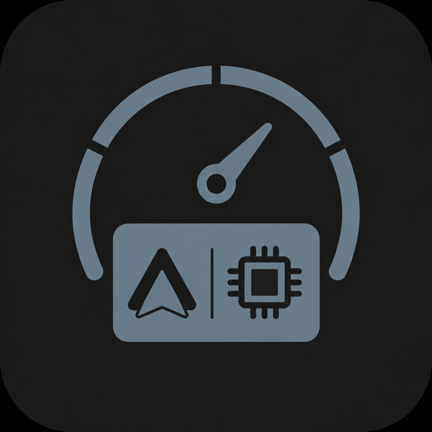
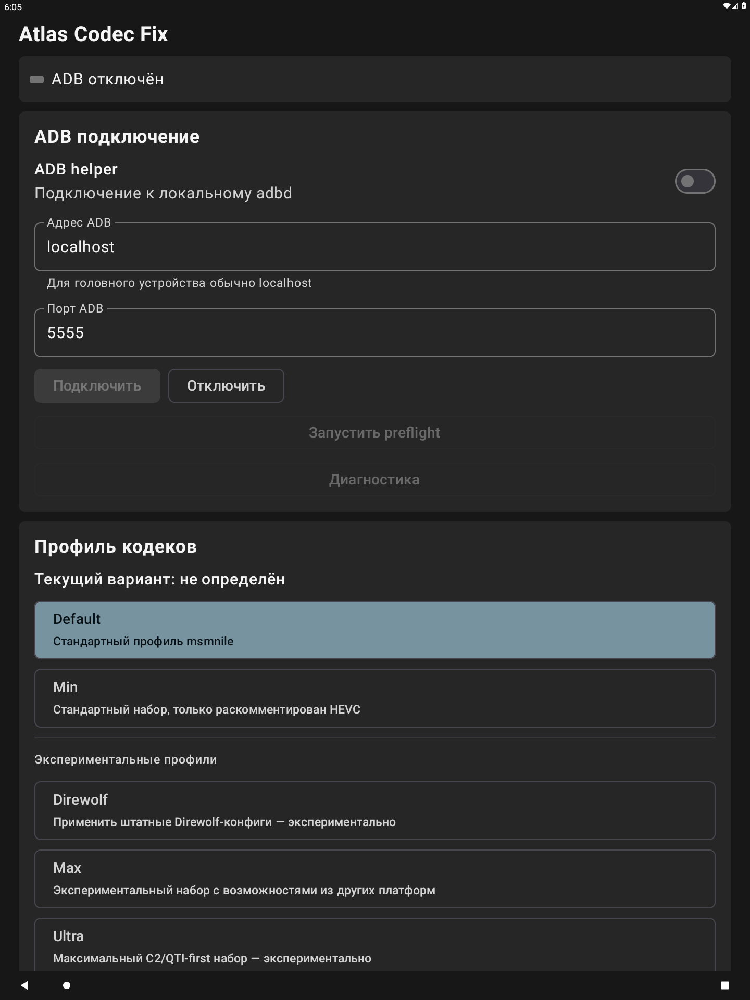
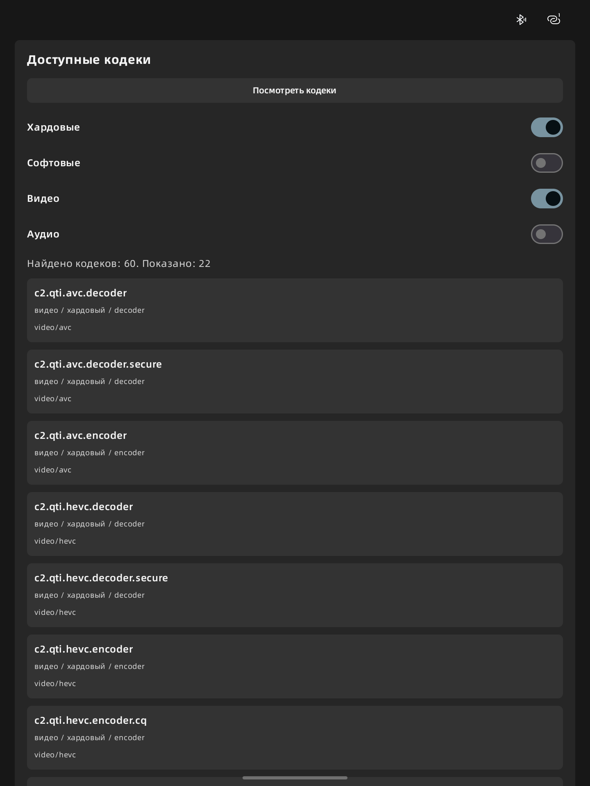

<p align="center">
  
</p>

<h1 align="center">Atlas Codec Fix</h1>

<p align="center">
  Переключатель конфигураций медиакодеков для Android-головных устройств с root-доступом
</p>

Atlas Codec Fix подключается к локальному `adbd`, проверяет совместимость устройства и через
`su root` временно перекрывает выбранные файлы конфигурации в `/vendor/etc` точечными bind mount.
Приложение предназначено прежде всего для устройств на платформе Qualcomm `msmnile` с ожидаемым
набором vendor-файлов.

> Приложение выполняет команды с root-правами. Неподходящая конфигурация может нарушить работу
> видео, звука или камеры до возврата профиля `Default` либо перезагрузки устройства.

## Интерфейс

Основной экран показывает состояние ADB, параметры подключения, активный и выбранный профили.
Экспериментальные варианты отделены от основных, а применение и повторная проверка профиля
запускаются раздельно.

<p align="center">
  <a href="docs/images/main-screen.png">
    
  </a>
</p>

Встроенный просмотрщик выводит обнаруженные Android-кодеки и позволяет отфильтровать их по
аппаратной или программной реализации, типу медиа и назначению.

<p align="center">
  <a href="docs/images/codecs-screen.png">
    
  </a>
</p>

## Возможности

- подключение к ADB по настраиваемым адресу и TCP-порту; доступны режимы Atlas (`5555`),
  Preface (`7777`) и Custom;
- совместимый с GInputBridge Telnet-режим с автоматическим обнаружением локального shell и
  ограниченным автоматическим переподключением после обрыва транспорта;
- сохранение ADB-ключа в приватном no-backup хранилище приложения;
- отдельные preflight-проверка и диагностика устройства без изменения конфигурации;
- выгрузка текущих codec-конфигов из стандартных `/vendor/etc`, `/product/etc` и `/system/etc`
  вместе с отдельным `params.txt` в `Downloads/ACF/<timestamp>/`;
- ручное применение профиля с подтверждением риска для экспериментальных вариантов;
- проверка каждого bind mount и автоматический возврат к штатной конфигурации при ошибке или
  несовпадении определённого профиля;
- безопасная операция `Default`, которая не зависит от preflight и файлов других профилей;
- отложенное автоприменение после загрузки Android с ограниченным числом повторов;
- просмотр доступных Android-кодеков с фильтрами по типу, назначению и аппаратному ускорению;
- опциональные уведомления об ошибках ADB, preflight и применения.

## Профили

| Профиль | Назначение | Статус |
| --- | --- | --- |
| `Default` | Снимает активные bind mount и возвращает штатную конфигурацию `msmnile`. | Восстановление |
| `Min` | Подменяет только `media_codecs_msmnile.xml` вариантом с активными объявлениями кодеков C2/QTI HEVC. | Основной |
| `Direwolf` | Накладывает присутствующие на устройстве штатные Direwolf-конфиги на цели `msmnile`. | Экспериментальный |
| `Max` | Применяет агрегированный набор codec, performance, media profile и video specs из нескольких платформ. | Экспериментальный |
| `Ultra` | Применяет агрегированный C2/QTI-first набор codec, performance, media profile и video specs. | Экспериментальный |

Для ручного применения экспериментального профиля приложение всегда запрашивает явное
подтверждение. Его автоприменение доступно только при включённом `Небезопасном режиме`, который
также отключает preflight-защиту.

## Требования и совместимость

- Android 8.0 или новее (API 26+);
- root-доступ с рабочей командой `su root`;
- локальный демон ADB, доступный по TCP, обычно на `localhost:5555` или `localhost:7777`;
- для Telnet-режима — локальный telnet shell, который приложение обнаруживает среди локальных
  listening-портов;
- подтверждение ADB-ключа приложения при первом подключении, если его запрашивает устройство;
- для подтверждённого preflight — платформа `msmnile`, объявление кодека Qualcomm HEVC и файлы:
  - `/vendor/etc/media_codecs_msmnile.xml`;
  - `/vendor/etc/media_codecs_performance_msmnile.xml`;
  - `/vendor/etc/media_profiles_msmnile.xml`;
  - `/vendor/etc/video_system_specs.json`;
  - `/vendor/etc/media_msmnile/video_system_specs.json`.

Если необходимые файлы или объявление кодека HEVC отсутствуют, preflight помечает устройство как
неподдерживаемое. Другая платформа при наличии всех файлов получает статус `risky`: ручное
применение можно подтвердить явно, но безопасное автоприменение не разрешается.

Прошивки автомобильных ГУ различаются составом vendor-конфигурации, реализацией `su`, политиками
SELinux и поведением медиасервисов. Поэтому совместимость с конкретной моделью и версией прошивки
нужно проверять на реальном устройстве. Профили `Direwolf`, `Max` и `Ultra` намеренно считаются
экспериментальными.

## Установка и применение

1. Установите подписанный APK Atlas Codec Fix на головное устройство.
2. Убедитесь, что локальный `adbd` принимает TCP-подключения и устройству доступен `su root`.
3. Откройте приложение и включите `ADB helper`.
4. Выберите режим подключения: `Atlas`, `Preface`, `Custom` или `Telnet`; для первых трёх
   укажите адрес и порт, затем нажмите `Подключить`.
5. Запустите `preflight` или откройте `Диагностика`, не изменяющую конфигурацию. Для выгрузки
   данных нажмите `Выгрузить файлы для анализа`: в `Downloads/ACF/<timestamp>/default/` будут
   сохранены найденные codec XML/JSON-файлы, а параметры и настройки — в `params.txt`.
6. Выберите профиль и нажмите `Применить`. Для экспериментального профиля подтвердите риск.
7. Нажмите `Проверить`, чтобы заново определить активный профиль, и при необходимости откройте
   список доступных кодеков.
8. Для повторного применения после перезагрузки включите `Codecfix после загрузки` и задайте
   задержку от 0 до 3600 секунд.

Bind mount существуют только до перезагрузки. Чтобы вернуть штатное состояние без перезагрузки,
примените `Default`. Медиасервисы перезапускаются только после проверки полного набора mount'ов или
после явного восстановления.

## Как выполняется применение

1. Приложение подготавливает root-скрипты и, если нужны, встроенные файлы выбранного профиля во
   временном каталоге.
2. Через ADB выполняется цепочка `su root sh -c`.
3. Для профиля, отличного от `Default`, запускается preflight, если пользователь явно не отключил
   его в небезопасном режиме.
4. Подготовленный каталог атомарно размещается в `/dev/hevc`. Для `Min`, `Max` и `Ultra`
   накладываются только файлы, перечисленные в `profile.manifest`; `Direwolf` использует отдельный
   фиксированный набор штатных vendor-файлов устройства.
5. Каждый mount проверяется по таблице mount'ов и содержимому файла.
6. Итоговый профиль определяется повторно. Любая ошибка или несовпадение запускает откат к
   штатному состоянию.

## Сборка и проверка

Требуются JDK 17 и Android SDK 36. Используйте Gradle Wrapper из репозитория:

```sh
ANDROID_HOME=/path/to/android-sdk sh gradlew verify :app:assembleDebug
```

Задача `verify` запускает JVM unit tests, Android lint, тест root-транзакции с имитацией mount и
проверку XML, JSONC, манифестов и инвариантов профилей. Debug APK создаётся в
`app/build/outputs/apk/debug/`.

Для release-сборки скопируйте пример `app/_secure.signing.gradle` в игнорируемый Git файл
`secure.signing.gradle`, заполните параметры ключа и выполните:

```sh
ANDROID_HOME=/path/to/android-sdk sh gradlew :app:assembleRelease
```

Без настроенной приватной подписи сборка release-варианта завершается ошибкой; проект не
подменяет release-ключ стандартным debug-ключом. Итоговый APK создаётся в
`app/build/outputs/apk/release/` с именем вида
`<versionName>[<versionCode>]AtlasCodecFix-release.apk`.

Проверьте подпись собранного release APK:

```sh
apksigner verify --verbose --print-certs app/build/outputs/apk/release/*.apk
```

## Документация и исходные конфигурации

- [`hevc/preflight.sh`](hevc/preflight.sh) — проверка root, vendor-файлов, объявления HEVC и
  платформы;
- [`hevc/codecfix.sh`](hevc/codecfix.sh) — restore/apply-транзакция, проверка mount и откат;
- [`hevc/detect.sh`](hevc/detect.sh) — определение активного профиля;
- [`NOTICE.md`](NOTICE.md) — условия и уведомления для включённых Qualcomm/vendor-конфигураций.

Проект пока не предоставляет общую open-source лицензию. Перед распространением APK или
vendor-конфигураций ознакомьтесь с [`NOTICE.md`](NOTICE.md).
